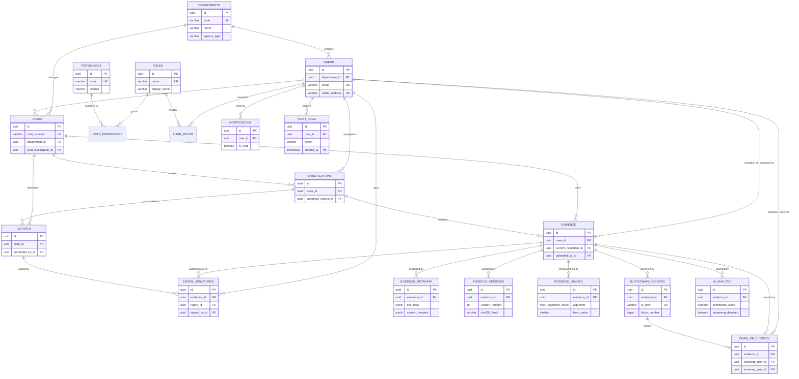

# SentinelChain — Enterprise Digital Forensics Database Architecture

> **Version**: 3.0 &nbsp;|&nbsp; **Classification**: CONFIDENTIAL &nbsp;|&nbsp; **Target Engine**: PostgreSQL 16+
> **Prepared by**: Lead Database Architect & Security Engineering Team

---

## 1. Executive Summary

The **SentinelChain Database Architecture** is an enterprise-grade, highly-normalized relational data model designed specifically for digital evidence management, law enforcement agencies, cyber forensic laboratories, and judicial evidence admissibility.

It models **17 core domain entities** with strict referential integrity, automated audit trails, multi-algorithm cryptographic verification, role-based access control (RBAC), and high-throughput time-series range partitioning.

---

## 2. Entity-Relationship (ER) Diagram



---

## 3. Data Dictionary & Table Mapping

| # | Table Name | Purpose | Key Constraints | Soft Delete? |
|---|------------|---------|-----------------|--------------|
| 1 | `departments` | Law enforcement & judicial agencies | `code` UNIQUE | Yes (`is_deleted`) |
| 2 | `roles` | System roles (Admin, Investigator, Analyst, Judge) | `name` UNIQUE | System guarded |
| 3 | `permissions` | Granular permission definitions | `code` UNIQUE | Immutable |
| 4 | `role_permissions` | RBAC role-permission mapping | Composite PK (`role_id, permission_id`) | N/A |
| 5 | `users` | Investigators, analysts, administrators | `email` UNIQUE, `wallet_address` UNIQUE | Yes (`is_deleted`) |
| 6 | `user_roles` | User-role assignment | Composite PK (`user_id, role_id`) | N/A |
| 7 | `cases` | Case files grouping evidence & findings | `case_number` UNIQUE | Yes (`is_deleted`) |
| 8 | `investigations` | Sub-investigations per case | FK `case_id` | Yes (`is_deleted`) |
| 9 | `evidence` | Digital evidence artifacts | FK `case_id`, FK `current_custodian_id` | Yes (`is_deleted`) |
| 10 | `evidence_metadata` | EXIF, hardware, geo-location, headers | FK `evidence_id`, JSONB Path | No |
| 11 | `evidence_versions` | Derivatives, sanitized copies, exports | Composite UNIQUE (`evidence_id, version_number`) | No |
| 12 | `evidence_hashes` | Multi-algorithm receipts (SHA-256, MD5, SHA-512) | Composite UNIQUE (`evidence_id, algorithm`) | Immutable |
| 13 | `blockchain_records` | Polygon Amoy on-chain receipts | `tx_hash` UNIQUE | Immutable |
| 14 | `digital_signatures` | PKI non-repudiation signatures | FK `signed_by_id`, Base64 signature data | Immutable |
| 15 | `chain_of_custody` | Custody transfer event log | FK `releasing_user_id`, FK `receiving_user_id` | Immutable |
| 16 | `ai_analysis` | Deepfake, ELA, and anomaly detection results | FK `evidence_id`, JSONB anomalies | Immutable |
| 17 | `reports` | Expert witness & forensic reports | FK `case_id`, FK `signature_id` | Yes (`is_deleted`) |
| 18 | `notifications` | User alerts & system notifications | FK `user_id`, `is_read` flag | Hard deleted |
| 19 | `audit_logs` | Immutable audit trail | **Partitioned by Range on `created_at`** | Immutable |

---

## 4. Key Architectural Capabilities

### 4.1 Automated Chain of Custody Synchronization
When a new custody transfer record is inserted into `chain_of_custody`, a PostgreSQL trigger (`trg_chain_of_custody_sync`) automatically updates `evidence.current_custodian_id` to match `receiving_user_id`.

### 4.2 Multi-Algorithm Hashes
The database supports storing multiple cryptographic hashes (SHA-256, SHA-512, MD5, SHA-3) per evidence item in `evidence_hashes` to guarantee cryptographic non-repudiation.

### 4.3 High-Volume Audit Log Partitioning
`audit_logs` is implemented as a **PostgreSQL Range Partitioned Table** partitioned by quarter on `created_at`. This allows querying millions of log rows without performance degradation.

### 4.4 Automated SHA-256 Verification Procedure
The stored function `fn_verify_evidence_integrity(evidence_id, scanned_sha256, verifier_id)` automatically compares a scanned hash with the on-chain and database checksums and returns an instant verification status payload.

---

## 5. Indexing & Optimization Strategy

1. **Trigram GIN Indexes (`pg_trgm`)**: Enable ultra-fast fuzzy title and filename search (`idx_cases_title_trgm`, `idx_evidence_filename_trgm`).
2. **JSONB Path Indexes (`jsonb_path_ops`)**: Index nested EXIF camera data, AI anomaly lists, and audit details (`idx_evidence_metadata_exif`, `idx_ai_analysis_anomalies`).
3. **Partial Indexes**: Exclude soft-deleted rows from indexes (`WHERE is_deleted = FALSE`) to reduce index size by up to 40%.
4. **Materialized Views**: `mv_monthly_evidence_analytics` pre-aggregates evidence counts and AI confidence scores by department and category for instant dashboard loading.

---

## 6. Execution & Deployment

The schema file is available in the repository at [`database/enterprise_schema.sql`](file:///c:/Users/VICTUS/Documents/sairam/database/enterprise_schema.sql).

To deploy:
```bash
psql -U postgres -d sentinelchain -f database/enterprise_schema.sql
```
