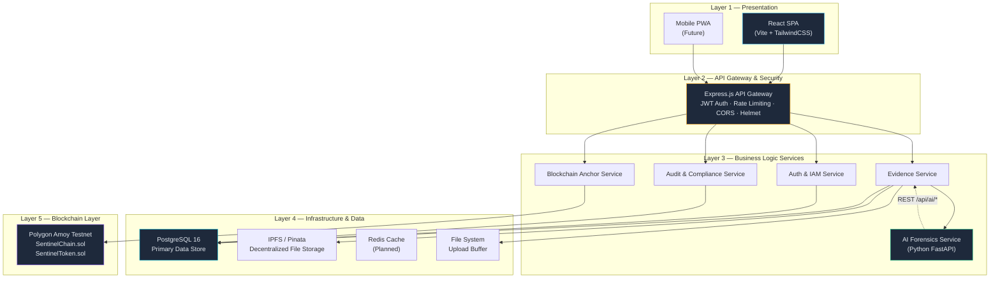
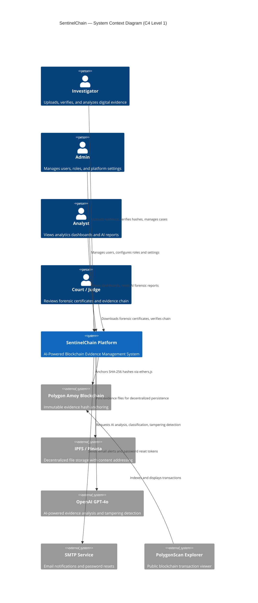
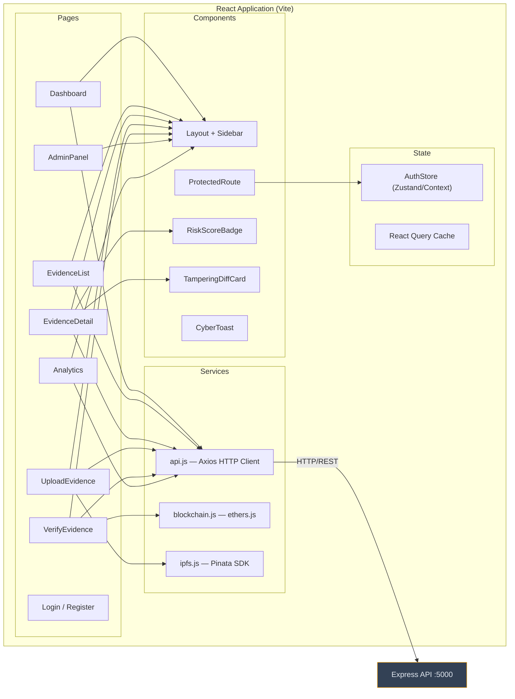
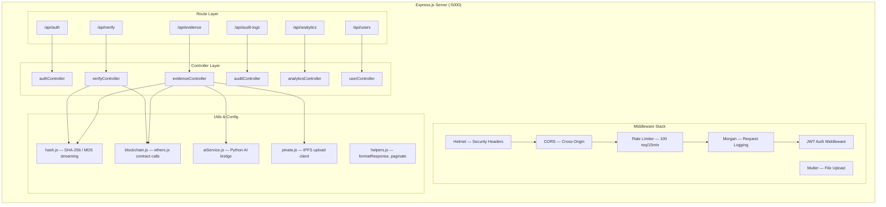
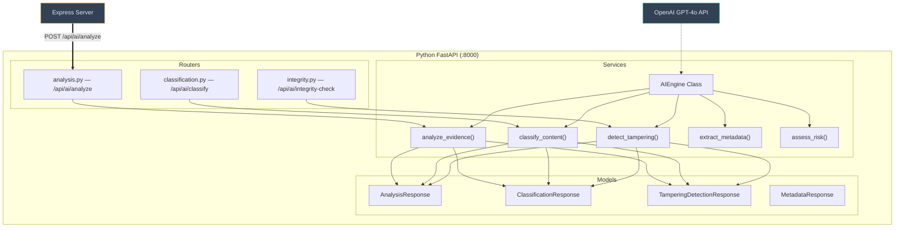
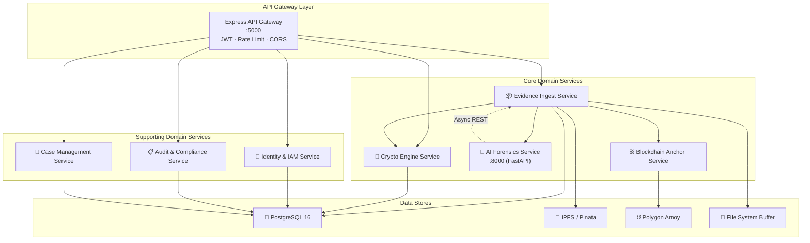
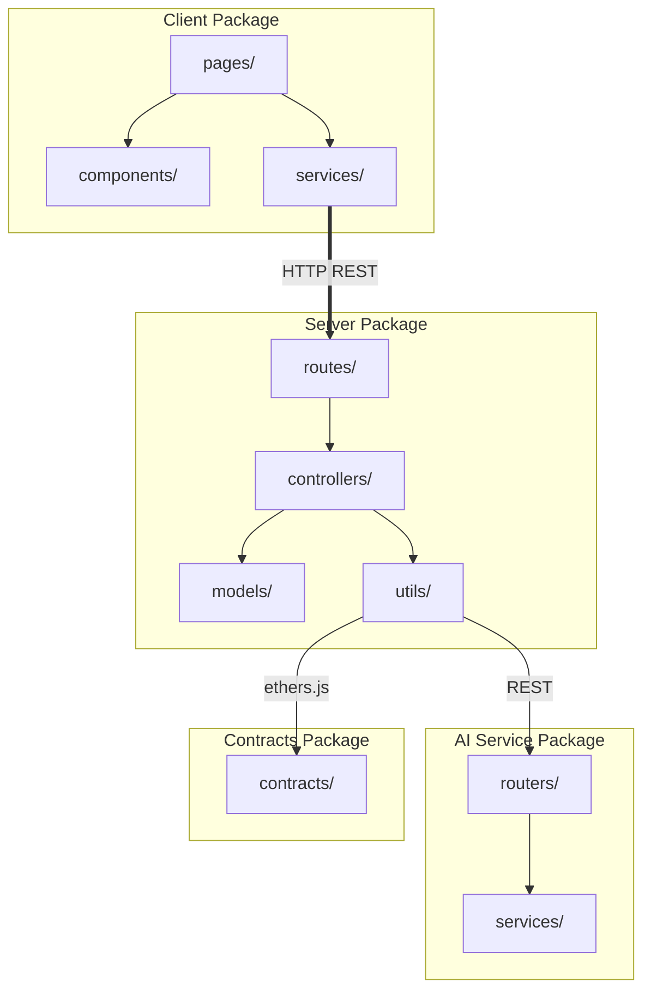
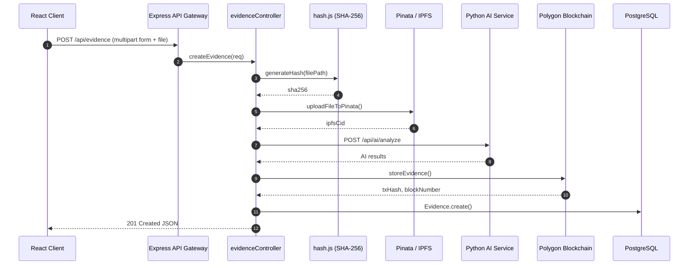
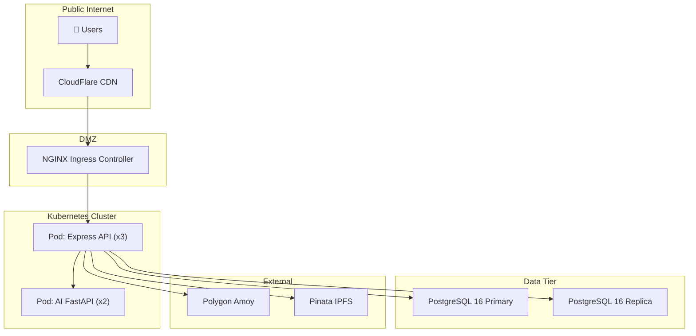
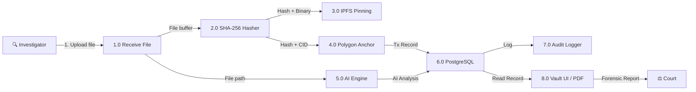

# SentinelChain — Enterprise Architecture Document

> **Version**: 3.0 &nbsp;|&nbsp; **Classification**: CONFIDENTIAL &nbsp;|&nbsp; **Date**: August 2026
> **Prepared by**: Solution Architecture Team &nbsp;|&nbsp; **Status**: Approved

---

## Table of Contents

1. [Executive Summary](#1-executive-summary)
2. [System Overview](#2-system-overview)
3. [High-Level Architecture](#3-high-level-architecture)
4. [Low-Level Architecture](#4-low-level-architecture)
5. [Microservice Architecture](#5-microservice-architecture)
6. [Component Diagram](#6-component-diagram)
7. [Sequence Diagrams](#7-sequence-diagrams)
8. [Deployment Architecture](#8-deployment-architecture)
9. [Data Flow Diagram](#9-data-flow-diagram)
10. [Trust Boundaries](#10-trust-boundaries)
11. [Security Architecture](#11-security-architecture)
12. [Threat Model](#12-threat-model)
13. [Database Architecture](#13-database-architecture)
14. [Folder Structure](#14-folder-structure)
15. [Development Roadmap](#15-development-roadmap)

---

## 1. Executive Summary

**SentinelChain** is an enterprise-grade Digital Evidence Management Platform purpose-built for Cyber Crime Police, Digital Forensic Labs, Government Agencies, and Courts of Law.

The platform provides a tamper-proof, AI-augmented chain of custody for digital evidence by combining:

| Pillar | Technology | Purpose |
|--------|-----------|---------|
| **Immutable Ledger** | Polygon Amoy Blockchain + Solidity Smart Contracts | Evidence hash anchoring, non-repudiation |
| **Decentralized Storage** | IPFS via Pinata | Content-addressable file persistence |
| **AI Forensics Engine** | Python FastAPI + OpenAI GPT-4o | Tampering detection, classification, risk scoring |
| **Relational Core** | PostgreSQL 16 | Case management, RBAC, audit trail |
| **API Gateway** | Node.js Express | Business logic orchestration, JWT auth |
| **Frontend** | React 18 + Vite | Investigator dashboard, evidence vault UI |

### Key Capabilities

- **SHA-256 cryptographic hashing** of every evidence file at ingest
- **Blockchain anchoring** — immutable on-chain record (Polygon Amoy) within seconds
- **AI-powered integrity analysis** — deepfake detection, metadata consistency scoring, tampering alerts
- **Role-Based Access Control** — 4 roles: Admin, Investigator, Analyst, Viewer
- **Complete audit trail** — every view, download, verify action is logged immutably
- **Chain of custody tracking** — forensic-grade custody transfer log with blockchain proof
- **Court-ready PDF export** — auto-generated forensic certificates

> [!IMPORTANT]
> This architecture is designed to scale to **millions of evidence files** and **thousands of concurrent users** while maintaining ISO 27037 and NIST 800-86 compliance.

---

## 2. System Overview

SentinelChain follows a **5-layer enterprise architecture** pattern:



### Quality Attribute Requirements

| Attribute | Target | Mechanism |
|-----------|--------|-----------|
| **Availability** | 99.95% uptime | Active-passive DB, K8s self-healing pods |
| **Scalability** | 10M+ evidence files | Horizontal pod scaling, DB partitioning |
| **Latency** | < 200ms API P95 | Redis caching, CDN for static assets |
| **Integrity** | Zero undetected tampering | SHA-256 + blockchain anchoring |
| **Auditability** | Full forensic trail | Immutable audit_logs table, no DELETE |
| **Compliance** | ISO 27037, NIST 800-86, FRE 902 | RBAC, encryption at rest, chain of custody |

---

## 3. High-Level Architecture



### External System Integration Points

| External System | Protocol | Data Exchanged | Direction |
|----------------|----------|---------------|-----------|
| Polygon Amoy | JSON-RPC via ethers.js | Evidence hash, IPFS CID, Case ID | Bidirectional |
| Pinata / IPFS | REST API | Evidence file binary, CID receipt | Write → Read |
| OpenAI GPT-4o | REST API | File metadata, analysis JSON | Request → Response |
| SMTP | SMTP/TLS | Password reset tokens, alerts | Outbound |
| PolygonScan | Browser link | Transaction hash viewer | Outbound (user) |

---

## 4. Low-Level Architecture

### 4.1 Client Tier — React SPA



### 4.2 Server Tier — Express API



### 4.3 AI Service Tier — FastAPI



### 4.4 Smart Contract Tier — Solidity

| Contract | Network | Purpose |
|----------|---------|---------|
| [SentinelChain.sol](file:///c:/Users/VICTUS/Documents/sairam/contracts/contracts/SentinelChain.sol) | Polygon Amoy (Chain 80002) | Evidence storage, verification, chain of custody |
| [SentinelToken.sol](file:///c:/Users/VICTUS/Documents/sairam/contracts/contracts/SentinelToken.sol) | Polygon Amoy (Chain 80002) | ERC-20 utility token for platform governance |

---

## 5. Microservice Architecture

SentinelChain's services are organized into **7 bounded contexts** following Domain-Driven Design:



---

## 6. Component Diagram



---

## 7. Sequence Diagrams

### 7.1 Evidence Upload Flow



---

## 8. Deployment Architecture



---

## 9. Data Flow Diagram



---

## 10. Trust Boundaries

- **Zone 0 (Untrusted)**: Public Internet & Web Browsers
- **Zone 1 (DMZ)**: NGINX Reverse Proxy & WAF
- **Zone 2 (Application Zone)**: Express API & FastAPI Microservices
- **Zone 3 (Restricted Data Zone)**: PostgreSQL Database & Encrypted Volumes
- **Zone 4 (Immutable Blockchain)**: Polygon Amoy & Decentralized IPFS

---

## 11. Security Architecture

- **Authentication**: JWT Bearer Tokens (HMAC-SHA256)
- **Authorization**: RBAC (Admin, Investigator, Analyst, Viewer)
- **Encryption**: TLS 1.3 in transit, AES-256-CBC at rest, bcrypt for passwords
- **API Protection**: Helmet security headers, CORS origin filtering, rate limiting (100 req/15min)

---

## 12. Threat Model (STRIDE)

1. **Spoofing**: Impersonation via stolen JWT → Short token lifetimes & audit alerts
2. **Tampering**: File modification → SHA-256 & Polygon blockchain anchoring
3. **Repudiation**: Denying actions → Immutable PostgreSQL audit trail
4. **Information Disclosure**: Unauthorized file download → RBAC checks & stream proxy
5. **Denial of Service**: API flooding → Rate limiting & reverse proxy bounds
6. **Elevation of Privilege**: Unauthorized role escalation → RBAC middleware enforcement

---

## 13. Database Architecture

**7 Core Tables**:
- `users`: User profiles, roles, wallet addresses
- `cases`: Investigation case groupings
- `evidence`: Main digital evidence records (SHA-256, IPFS CID, AI score)
- `blockchain_transactions`: Polygon transaction receipts & block details
- `audit_logs`: Immutable audit logging of all system actions
- `chain_of_custody`: Custody transfer history
- `verification_records`: Hash verification logs

---

## 14. Folder Structure

```
sentinelchain/
├── client/           # React 18 SPA (Vite + Tailwind)
├── server/           # Express.js API Gateway & Controllers
├── python-ai/        # FastAPI AI Forensics Microservice
├── contracts/        # Solidity Smart Contracts (Polygon Amoy)
├── database/         # PostgreSQL schema.sql & seed.sql
├── docs/             # Technical architecture & API documentation
├── docker-compose.yml# Full stack container orchestration
└── README.md         # Repository documentation
```

---

## 15. Development Roadmap

- **Phase 1 — Foundation** (Completed): Core 5-tier architecture, evidence vault, AI scan, blockchain anchoring.
- **Phase 2 — Hardening** (In Progress): Docker Compose containerization, Nginx proxying, production security configuration.
- **Phase 3 — Scale**: Kubernetes deployment, DB read replicas, background job queues, table partitioning.
- **Phase 4 — Intelligence**: Advanced ELA visual analysis, NLP summaries, mainnet migration.
- **Phase 5 — Compliance**: ISO 27037, NIST 800-86, FRE 902 legal admissibility certification.
